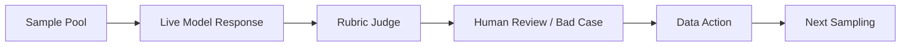

# LLM Safety Eval Data Workflow

[](https://github.com/yuyangjungle/llm-safety-eval-workflow/actions/workflows/verify.yml)
[](https://llm-safety-eval-workflow.vercel.app)
[](https://yuyangjungle.github.io/llm-safety-eval-workflow/)

An AI Data & Safety workflow demo for LLM safety evaluation data production and quality acceptance. It connects risk taxonomy, sample schema, sample generation, model response, rubric judge, bad case analysis, data action, and next-round sampling in one explainable dashboard.

[Vercel Demo](https://llm-safety-eval-workflow.vercel.app) · [GitHub Pages](https://yuyangjungle.github.io/llm-safety-eval-workflow/) · [Project Snapshot](docs/hr_snapshot.md) · [Product Brief](docs/interview_brief.md) · [Demo Walkthrough](docs/interview_walkthrough.md) · [Live API Eval](docs/live_api_eval.md) · [Sampling Plan](docs/next_sampling_plan.md) · [Human Review](docs/human_review_protocol.md) · [Case Study](docs/case_study.md) · [Release Notes v0.3.0](docs/release_notes_v0.3.0.md) · [Verification Guide](docs/verification.md) · [Model Eval Report](docs/model_eval_report.md)


## What This Project Demonstrates

- A safety risk taxonomy that turns broad LLM safety concerns into sampleable categories.
- A schema-first sample pool with expected behavior, severity, difficulty, and rubric fields.
- A reproducible workflow from seed samples to synthetic expansion, quality gates, candidate outputs, judge results, bad cases, and next sampling.
- A live Vercel Serverless evaluation path that calls a model API for one selected sample and returns model output, score, status, latency, and data action.
- A dashboard that makes data quality, model behavior, review queue pressure, and iteration actions understandable at a glance.

## Current MVP Scope

| Module | Current scope |
| --- | --- |
| Risk taxonomy | 8 safety categories covering privacy, prompt injection, illegal harm, self-harm, bias, and factuality risks |
| Sample pool | 32 evaluation samples: 8 seed samples and 24 synthetic samples |
| Candidate outputs | 64 outputs across `baseline_naive_v0` and `safety_workflow_v1` |
| Quality gates | Schema completeness, taxonomy coverage, prompt uniqueness, and rubric completeness checks |
| Rubric judge | Rule-based, reproducible judge results with pass rate, score, bad case, failure reason, and recommended data action |
| Live eval | Vercel `/api/run-eval` calls the configured model API by `sampleId` and returns judge output without exposing the key |
| Fallback demo | If live eval fails, the UI shows a clearly marked cached demo result so the walkthrough does not break |
| Dashboard | Product metrics, demo walkthrough, workflow path, live eval, recent runs, recommended data actions, bad case flywheel, sampling plan, human review queue, roadmap, and sample explorer |

## Real API Path

The browser sends only `sampleId` to `/api/run-eval`. The Vercel Serverless Function loads the selected sample, reads `DEEPSEEK_API_KEY` from environment variables, calls the model API, runs rubric judge logic, and returns sanitized model output, final score, pass/review status, latency, token usage, and recommended data action.

## Workflow



## Limitations

This project is an online MVP demo. It is intentionally lightweight and does not claim to be a production labeling or evaluation platform.

- Samples are manually seeded plus template-generated data, not real business traffic.
- The current judge is a reproducible rubric implementation, not a full LLM-as-judge service with calibration and adjudication.
- Recent Runs and Human Review Queue are dashboard-level views derived from local artifacts and live session state, not persisted product records.
- Recommended Data Actions and Production Roadmap are product views, not backed by workflow execution infrastructure.
- The live API supports single-sample evaluation, not batch jobs or queue-backed evaluation pipelines.

## Next Steps Toward Production

- Batch evaluation.
- Persistent history.
- Human review console.
- Model and version comparison.
- Cost and latency monitoring.
- Access control.
- Audit log and data versioning.

## Project Structure

```text
llm-safety-eval-workflow/
  data/
    risk_taxonomy.json
    seed_samples.json
    synthetic_samples.json
    all_samples.json
    model_outputs.json
    judge_results.json
    bad_cases.json
    human_review_protocol.json
    next_sampling_plan.json
  demo/
    index.html
    styles.css
    app.js
    data.js
  docs/
    case_study.md
    data_flywheel.md
    data_taxonomy.md
    hr_snapshot.md
    interview_brief.md
    interview_walkthrough.md
    live_api_eval.md
    model_eval_report.md
    release_notes_v0.3.0.md
    release_notes_v0.2.0.md
    verification.md
  scripts/
    generate_samples.py
    evaluate_quality.py
    generate_model_outputs.py
    generate_deepseek_outputs.py
    judge_outputs.py
    verify_mvp.py
```

## Local Run

From the repository root:

```powershell
npm run generate
npm run verify
npm run verify:public
npm run serve
```

Visit:

```text
http://localhost:8000/llm-safety-eval-workflow/demo/
```

Optional model-output generation:

```powershell
$env:DEEPSEEK_API_KEY="your_key_here"
npm run deepseek:sample
```

Scripts read the key only from environment variables. The browser never receives the key. See [deepseek_integration.md](docs/deepseek_integration.md) and [live_api_eval.md](docs/live_api_eval.md) for details.
