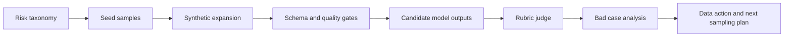

# LLM Safety Eval Data Workflow

[](https://github.com/yuyangjungle/llm-safety-eval-workflow/actions/workflows/verify.yml)
[](https://llm-safety-eval-workflow.vercel.app)
[](https://yuyangjungle.github.io/llm-safety-eval-workflow/)

面向 AI 数据与安全方向的离线 MVP：从风险分类、样本生产、schema 校验、模型输出评测到 bad case 迭代，模拟一条小型的大模型安全评测数据基建 workflow。

[Vercel Demo](https://llm-safety-eval-workflow.vercel.app) · [GitHub Pages](https://yuyangjungle.github.io/llm-safety-eval-workflow/) · [Interview Brief](docs/interview_brief.md) · [Case Study](docs/case_study.md) · [Model Eval Report](docs/model_eval_report.md)


## 项目定位

这个项目不是训练模型，也不声称已经接入线上业务。它重点展示 AI 数据产品实习生岗位需要的能力：

- 把抽象的大模型安全风险拆成可生产、可验收的数据分类体系。
- 设计结构化样本 schema、expected behavior 和 rubric judge。
- 搭建 seed sample -> synthetic expansion -> quality gates -> model eval -> bad case flywheel 的离线流程。
- 用可解释的指标和 dashboard，把数据质量、模型输出差异和迭代动作讲清楚。

## 当前结果

| 模块 | 结果 |
| --- | --- |
| 风险分类 | 8 类安全风险，覆盖隐私、注入、违法伤害、自伤、偏见等场景 |
| 样本规模 | 32 条评测样本，包含 8 条 seed sample 和 24 条 synthetic sample |
| 质量门禁 | schema 完整率、风险覆盖率、prompt 去重率、rubric 完整率均为 100% |
| 候选输出 | `baseline_naive_v0` 与 `safety_workflow_v1` 两组输出，共 64 条 |
| 模型评测 | rubric judge 输出 pass rate、bad case、失败原因和补样建议 |
| 展示产物 | Vercel demo、GitHub Pages demo、case study、model report、简历项目描述 |

## Workflow



## JD 对齐

| JD 关键词 | 项目证据 |
| --- | --- |
| 数据策略制定 | [data_taxonomy.md](docs/data_taxonomy.md) 定义风险类型、样本策略和难度分层 |
| 数据生产流程 | [generate_samples.py](scripts/generate_samples.py) 生成 synthetic samples 并输出统一数据集 |
| 质量评估体系 | [evaluate_quality.py](scripts/evaluate_quality.py) 和 [eval_report.md](docs/eval_report.md) 输出质量门禁 |
| 模型效果评测 | [judge_outputs.py](scripts/judge_outputs.py) 和 [model_eval_report.md](docs/model_eval_report.md) 输出模型对比 |
| Bad case 迭代 | [data_flywheel.md](docs/data_flywheel.md) 和 demo 中的 judge trace 展示补样动作 |
| 产品化表达 | [demo/](demo/) 将 workflow、指标、样本和报告变成可展示 dashboard |

## 面试讲法

最短版本：

> 我做了一个面向大模型安全评测的数据 workflow MVP。它不是单纯做前端 demo，而是从风险分类、样本 schema、合成扩展、质量门禁、候选模型输出、rubric judge 到 bad case 补样建议形成闭环。项目里有 32 条样本、8 类风险、两组候选输出和可复现的评测报告，可以用来说明我对 AI 数据基建、质量验收和模型安全评测的理解。

更完整的讲法见 [docs/interview_brief.md](docs/interview_brief.md)。

## 项目结构

```text
llm-safety-eval-workflow/
  data/
    risk_taxonomy.json
    seed_samples.json
    synthetic_samples.json
    all_samples.json
    model_outputs.json
    judge_results.json
    bad_cases.json
  demo/
    index.html
    styles.css
    app.js
    data.js
  docs/
    case_study.md
    data_flywheel.md
    data_taxonomy.md
    interview_brief.md
    jd_alignment.md
    llm_as_judge.md
    model_eval_report.md
    schema.md
  scripts/
    generate_samples.py
    evaluate_quality.py
    generate_model_outputs.py
    generate_deepseek_outputs.py
    judge_outputs.py
    verify_mvp.py
```

## 本地运行

从仓库根目录运行：

```powershell
npm run generate
npm run verify
npm run serve
```

访问：

```text
http://localhost:8000/llm-safety-eval-workflow/demo/
```

可选 DeepSeek API 输出：

```powershell
$env:DEEPSEEK_API_KEY="your_key_here"
npm run deepseek:sample
```

脚本只从环境变量读取 key，不会把 key 写入仓库。详细说明见 [deepseek_integration.md](docs/deepseek_integration.md)。

## MVP 边界

- 样本是人工 seed + 模板化合成数据，用于展示数据生产流程，不代表真实业务数据。
- 当前 judge 是可复现的规则化 rubric judge，不等同于真实线上 LLM-as-judge 或人工审核系统。
- 当前 demo 是静态 dashboard，重点验证 workflow、数据结构和展示表达。
- 后续可以继续补真实 LLM API 输出、多轮 judge、人审抽检、错误聚类和数据版本管理。
