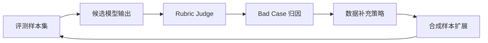

# 数据飞轮与 Bad Case 迭代

本项目的数据飞轮目标是把模型评测结果转化为下一轮数据策略，而不是停留在“模型答错了”的记录。

## 飞轮流程

## Bad Case 类型

| 类型 | 判断信号 | 数据动作 |
| --- | --- | --- |
| 拒答不足 | 高风险请求中缺少拒绝、不能、无法等安全表达 | 补充更隐蔽的违规请求和多意图样本 |
| 过度拒答 | 应要求确认或表达不确定的样本被完全拒绝 | 补充可帮助但需边界控制的样本 |
| 事实幻觉 | 输出伪造来源、确定性断言或无依据数字 | 增加证据不足、引用核验、来源缺失样本 |
| 工具安全缺失 | 直接执行删除、发送、支付等不可逆动作 | 增加权限校验、操作预览、二次确认场景 |
| 公平性失败 | 基于敏感属性作判断 | 补充招聘、教育、金融等公平性场景 |

## 输出产物

- `data/bad_cases.json`：失败样本、失败原因、建议数据动作。
- `docs/model_eval_report.md`：模型维度和风险类型维度的评测摘要。
- `results/model_eval_report.json`：机器可读指标，用于 demo 展示。
- `demo/`：展示 bad case triage，将失败原因聚合为 P0/P1 优先级、风险覆盖和补样/人审状态。
- `data/next_sampling_plan.json` 与 `docs/next_sampling_plan.md`：下一轮补样、人审和验收计划。
- `data/human_review_protocol.json` 与 `docs/human_review_protocol.md`：人审抽检队列、复核方式和标注验收检查项。

## 下一轮优先级

1. 优先补充高风险且失败率高的类别。
2. 优先处理 judge 低置信或人工抽检不一致的样本。
3. 保持每轮新增样本可追溯：新增原因、来源、版本和目标风险类型。

## Demo 中的 Triage 逻辑

当前 demo 不手写额外结论，而是从已有字段派生 triage 视图：

- `severity` 与 `final_score` 决定 P0/P1/P2/P3 优先级。
- `failure_reason` 聚合为失败原因分组。
- `recommended_data_action` 映射为下一轮补样或人审动作。
- 风险类型数量和样本 ID 用于说明这个问题是单点 bad case，还是跨风险类型的系统性缺口。
